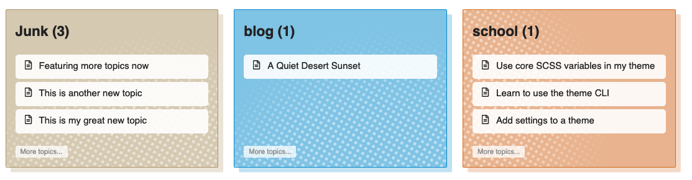
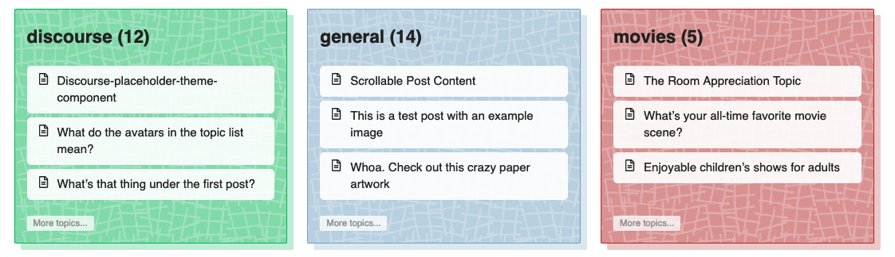
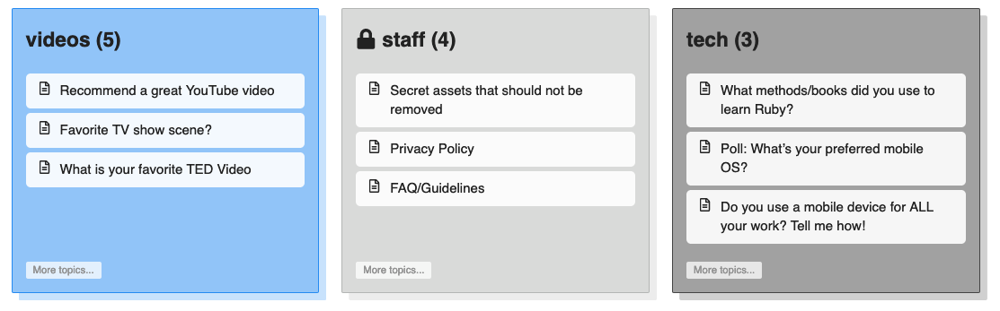
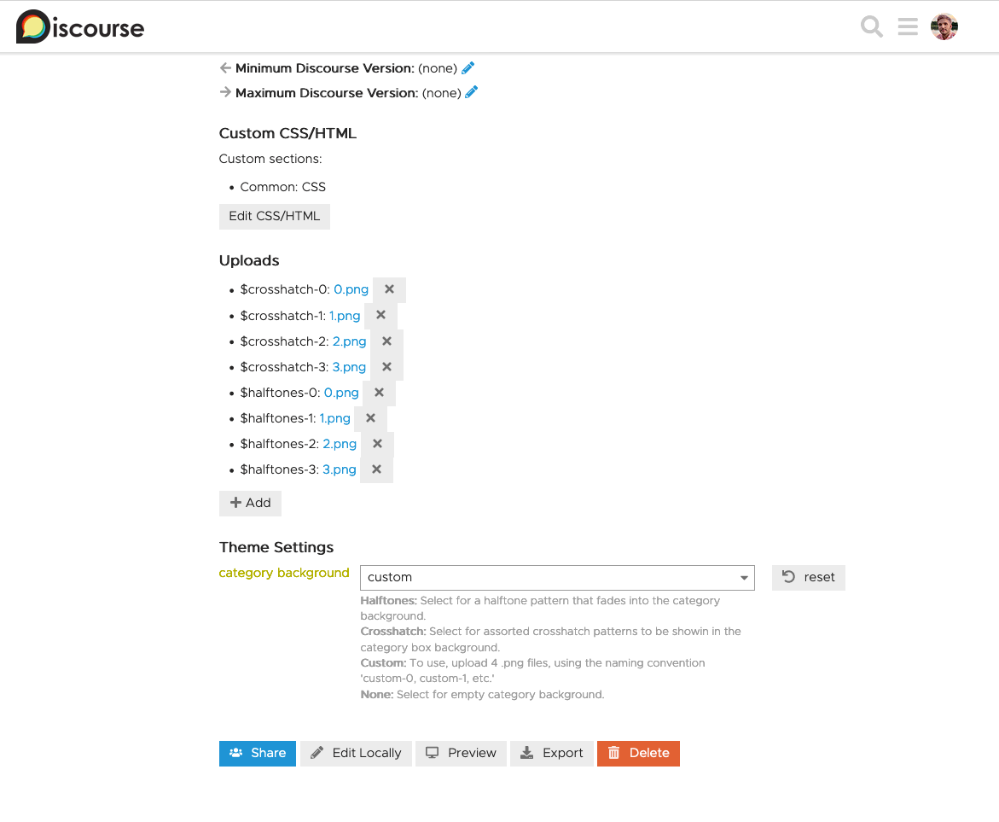

# Custom Category Boxes Component

This is a theme component that will render your categories as boxes with customized backgrounds on your categories page. This component will also render each category page with a category banner if `show_banner` is selected.

**For this to work... in the settings area `desktop category page style` needs to be set to either `categories with Featured Topics` or `Boxes with Featured Topics`**

There are four options to choose from. Default is `halftones`

### Halftone Background

### Crosshatch Background

### None

### Custom

If you would like to create this effect with some of your own artwork, upload 4 varying `.png`'s with transparent backgrounds or traditional `.jpg`'s in the settings page. For each upload, use the naming convention of `custom-0`, up to the last as `custom-3`. Be sure to select `custom` as your category background setting.

